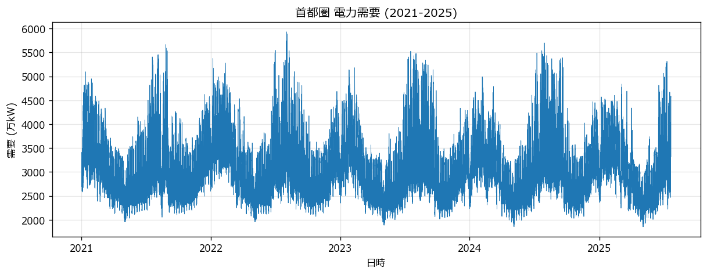
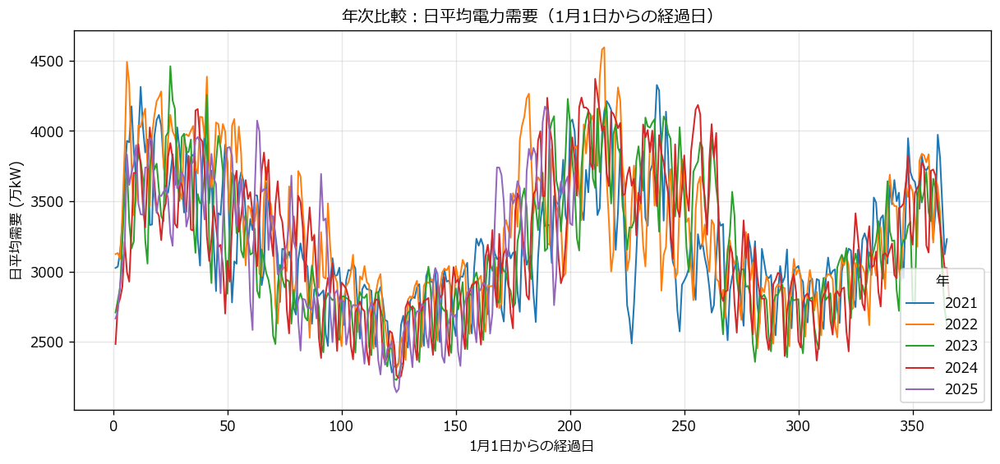
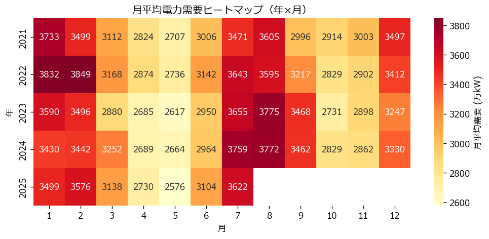
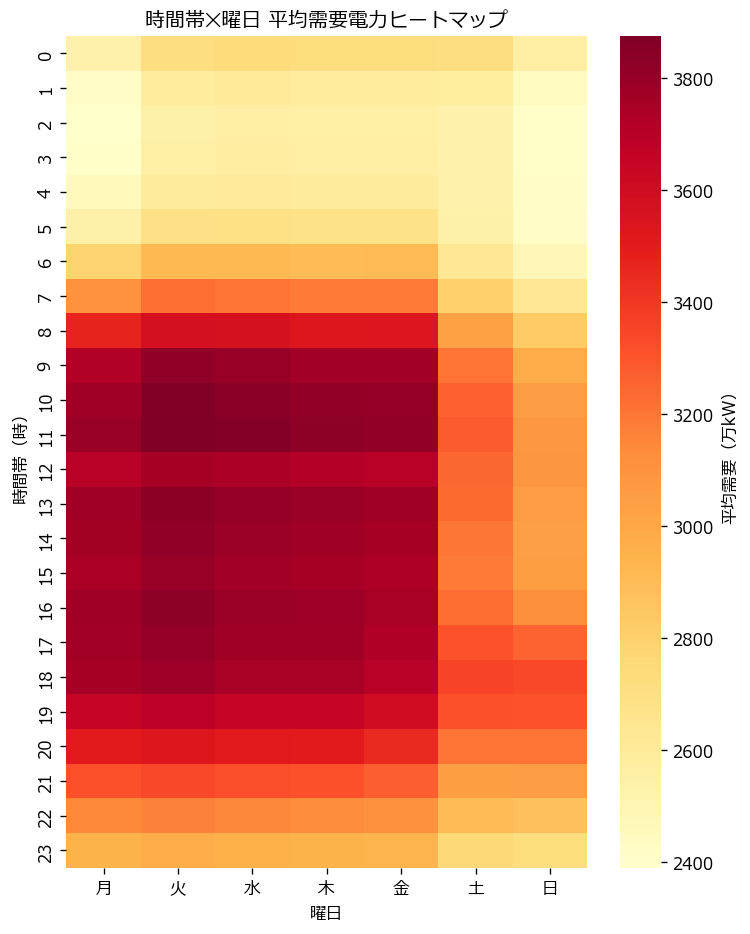
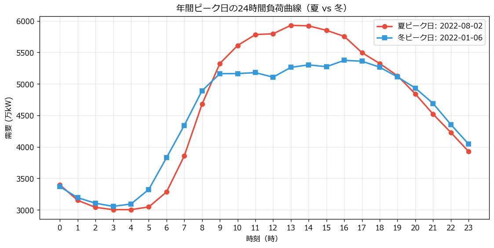

# 首都圏電力需要分析レポート

東京電力PowerGridが公開する電力需要実績データを用いて、
首都圏の電力消費パターンを分析・可視化したポートフォリオです。

## 🎯 このプロジェクトについて

電気主任技術者の業務観点から、データ分析・可視化を実施。
将来的にAI活用（需要予測・異常検知）まで発展させる予定です。

## 🛠 使用技術

- Python 3.12
- pandas
- matplotlib / seaborn
- Jupyter Notebook

## 📁 リポジトリ構成

```
├── data/raw/       # TEPCO CSV（取得スクリプトで生成）
├── notebooks/      # 分析用 Jupyter Notebook
├── src/            # データ取得スクリプト
├── docs/images/    # 出力グラフ
├── docs/           # 復習リファレンス
└── READ_ME.md
```

## 📊 分析結果（Stage 1 可視化）

### 1. 全期間の時系列推移（2021-2025）


5年間の需要推移。夏冬のピーク・春秋のボトムという季節パターンが明確。
2022年夏が突出（早期梅雨明け＋猛暑で需給ひっ迫警報の年）。

### 2. 年次比較（1月1日からの経過日で重ね）


5年分を日平均でオーバーレイ。GW・お盆の凹みなど産業需要の影響が可視化される。

### 3. 月平均ヒートマップ（年×月）


夏ピーク（7-8月）は年々上昇傾向、冬ピーク（1-2月）は2022年特異。
電力需給の最大制約が夏側に移っていることが読み取れる。

### 4. 時間帯×曜日パターン


平日昼の濃赤＝産業需要、夜（19-21時）の濃赤＝家庭需要、
深夜2-5時の淡黄＝ベース需要、という需要構成が視覚化される。

### 5. 年間ピーク日の24時間負荷曲線（夏 vs 冬）


2022/08/02（夏）と 2022/01/06（冬）の負荷曲線。
夏は午後単峰（13-14時 ≒ 5,950万kW）、冬は日中プラトー＋夕方ピーク
（17時 ≒ 5,380万kW）。再エネ対応の難しさが時間帯別に異なる。

## 🚀 実行方法

```powershell
git clone <this-repo>
cd power-demand-analysis
py -m venv .venv
.venv\Scripts\Activate.ps1
pip install -r requirements.txt

# データ取得
python src/fetch_tepco.py

# Notebook 起動
jupyter notebook notebooks/01_load_check.ipynb
```

## 📚 学習ドキュメント

- [Step 2 復習リスト](docs/step2_review.md) — データ取得・pandas基礎
- [Step 3 復習リスト](docs/step3_review.md) — 可視化基礎（作成予定）

## 📝 開発について

本プロジェクトは Claude（Anthropic）を学習・実装パートナーとして活用しながら、
電気主任技術者の業務知見を反映して開発しています。

## 👤 著者

電気主任技術者（第三種）／ Python・データ分析を学習中
