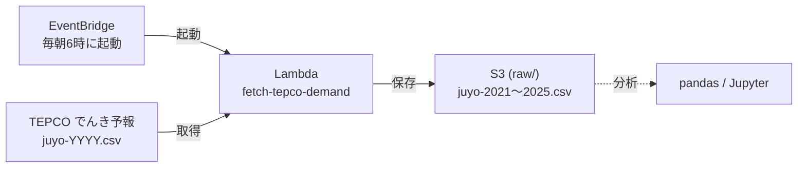

# AWSで毎日データを自動取得する仕組み

ローカルで手動で動かしていた `src/fetch_tepco.py` を、AWS上で毎日自動で動くようにしてみた記録。

## やりたかったこと

- 毎回手で実行していたデータ取得を自動にする
- 取ってきたCSVをS3にためておいて、後で分析に使えるようにする

## 構成

ざっくり言うと、EventBridge（タイマー）が毎朝Lambdaを動かして、LambdaがTEPCOからCSVを取ってきてS3に保存する、という流れ。

各パーツの役割：

- **EventBridge** … 毎朝6時（日本時間）にLambdaを動かすタイマー
- **Lambda** … TEPCOからCSVを取ってS3に保存するプログラム（[src/lambda_fetch_tepco.py](../src/lambda_fetch_tepco.py)）
- **S3** … データの保存場所
- **IAMロール** … LambdaがS3に書き込むための権限
- **CloudWatch Logs** … 実行ログ（動いたか確認する場所）

## つまずいた点・工夫したところ

- `requests` はLambdaに入っていなかったので、標準ライブラリの `urllib` で書き直した
- 今年分のCSVがまだ公開されてなくて404になったので、無ければ前年を取るようにした
- バケット名はコードに直書きせず、環境変数で渡すようにした
- LambdaがS3に書く権限は最初なくて権限エラーが出たので、`raw/` に書くぶんだけ許可した
- 過去年（2021〜2024）はもう変わらないので、手元のファイルを一度だけS3にアップロードした

## コスト

この規模だとほぼ無料だった。念のためAWS Budgetsで月1ドルの予算アラートを設定してある。

## これからやりたいこと

- AthenaでS3のデータに直接SQLを投げてみる
- 構成をコード（SAMやTerraform）で書けるようにする
